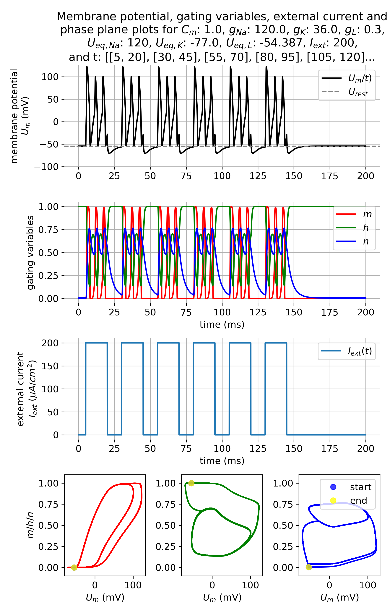

# Hodgkin-Huxley model

Python scripts supporting a tutorial on the Hodgkin-Huxley model. For more details, read this blog post:

* [Hodgkin-Huxley model](https://www.fabriziomusacchio.com/blog/2024-04-21-hodgkin_huxley_model/)

For reproducibility:

```bash
conda create -n hhmodel -y python=3.11
conda activate hhmodel
conda install -y mamba
mamba install -y ipykernel numpy matplotlib scipy
```

